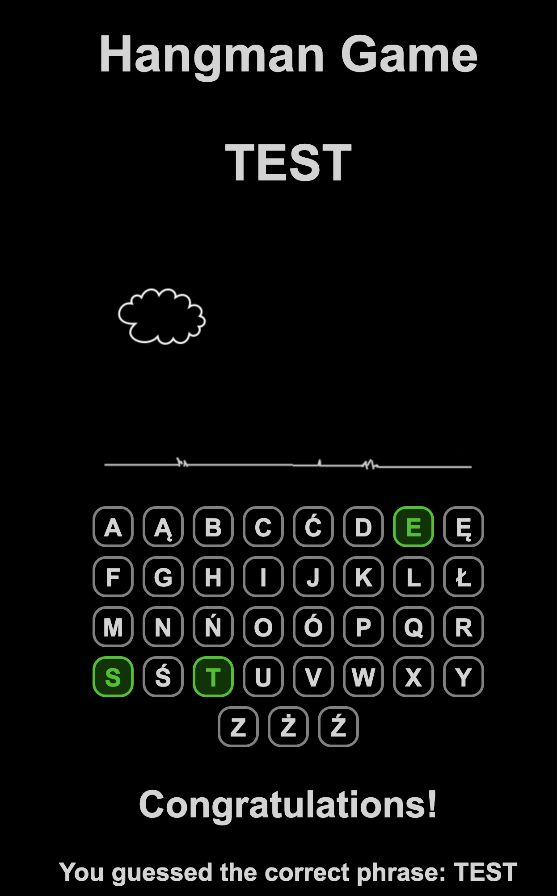
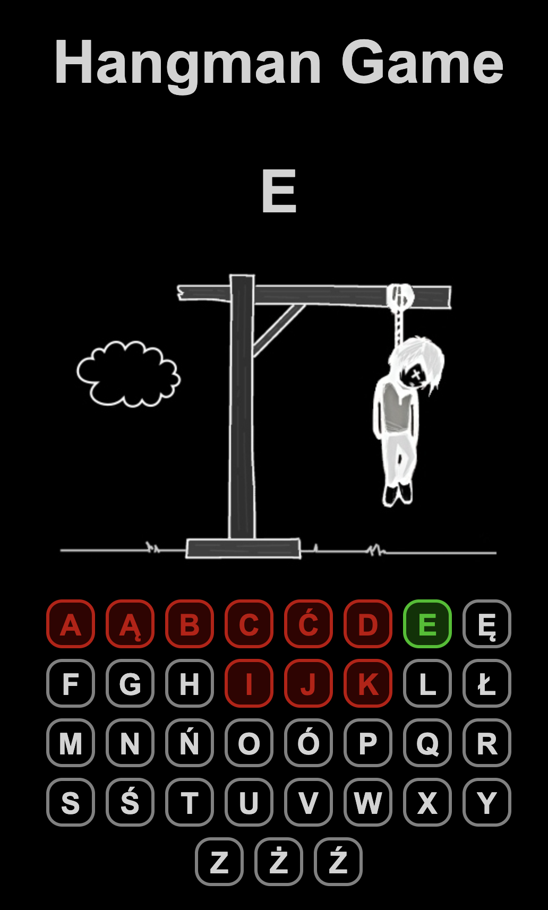

# Hangman Game

This is my first app - a simple Hangman game built with React.

## Installation

1. **Clone the repository:**

    ```bash
    git clone https://github.com/PiotrG1996/Hangman/tree/main
    ```

2. **Navigate to the project directory:**

    ```bash
    cd hangman-game
    ```

3. **Install dependencies:**

    ```bash
    npm install
    ```

4. **Start the development server:**

    ```bash
    npm start
    ```

5. **Open your browser and go to [http://localhost:3000](http://localhost:3000) to play the game.**

## Game Rules

- Enter a word or phrase in the input field and click "Start Game" to begin.
- Try to guess the hidden word or phrase by clicking on the letters provided.
- Each incorrect guess will display a part of the hangman.
- You win the game if you guess the word or phrase correctly before the hangman is complete.
- You lose the game if the hangman is complete before you guess the word or phrase.

|  |  |
|:---:|:---:|
| *Win Image* | *Game Over Image* |


Enjoy playing Hangman!

## License

This project is licensed under the [MIT License](LICENSE).

---

**Developed by:** Piotr Gapski
